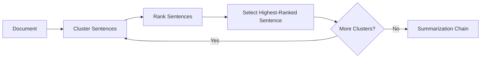
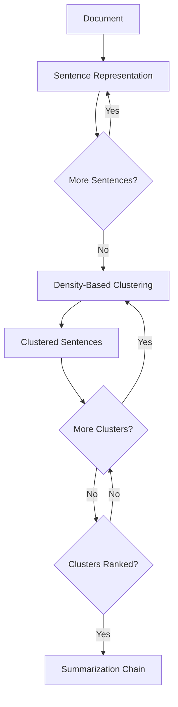
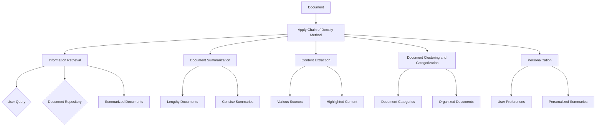
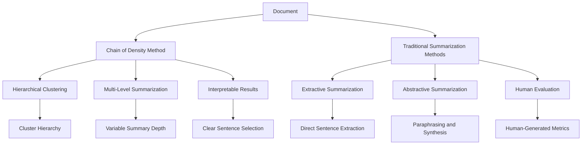
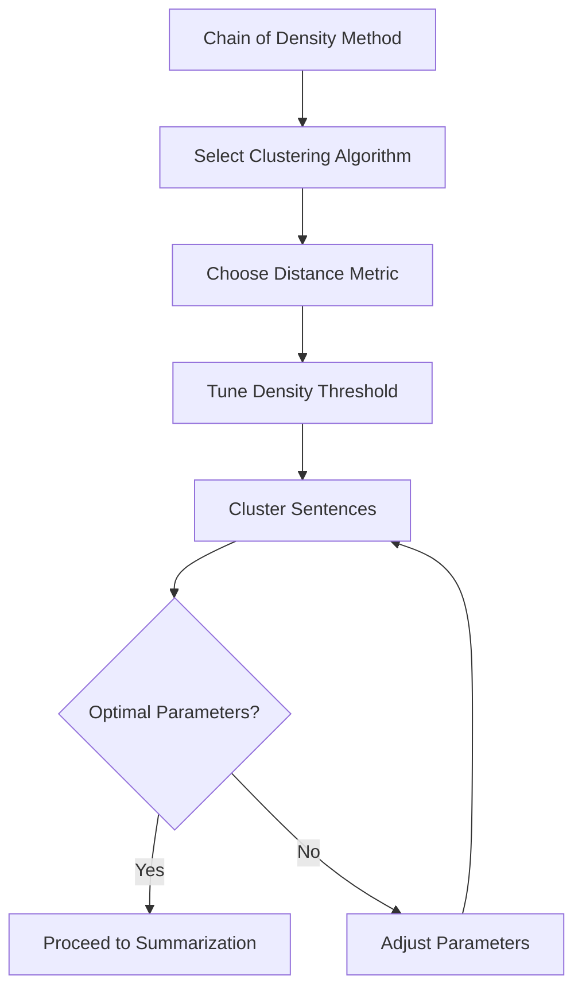
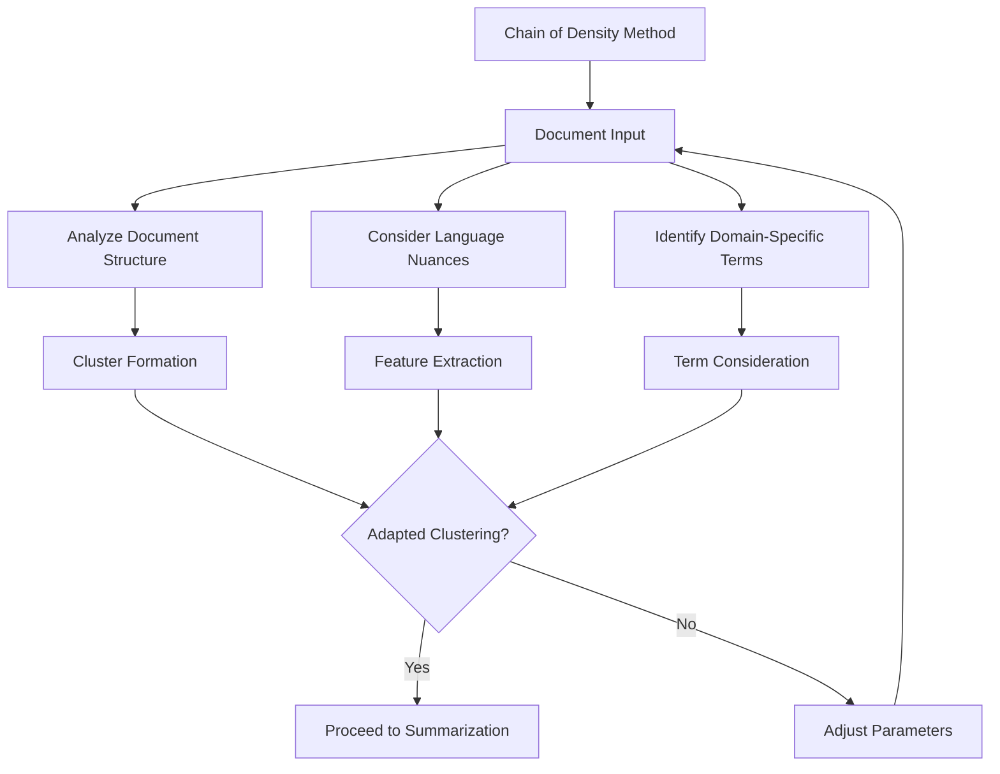
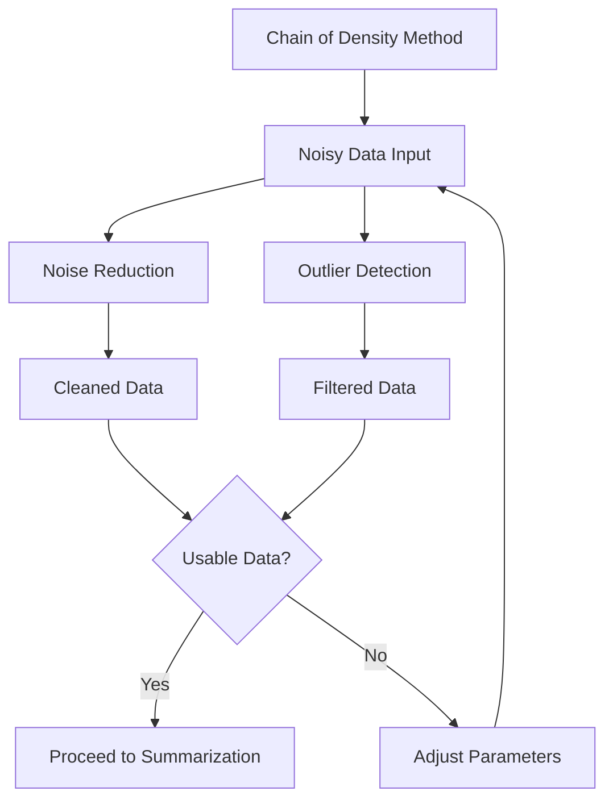
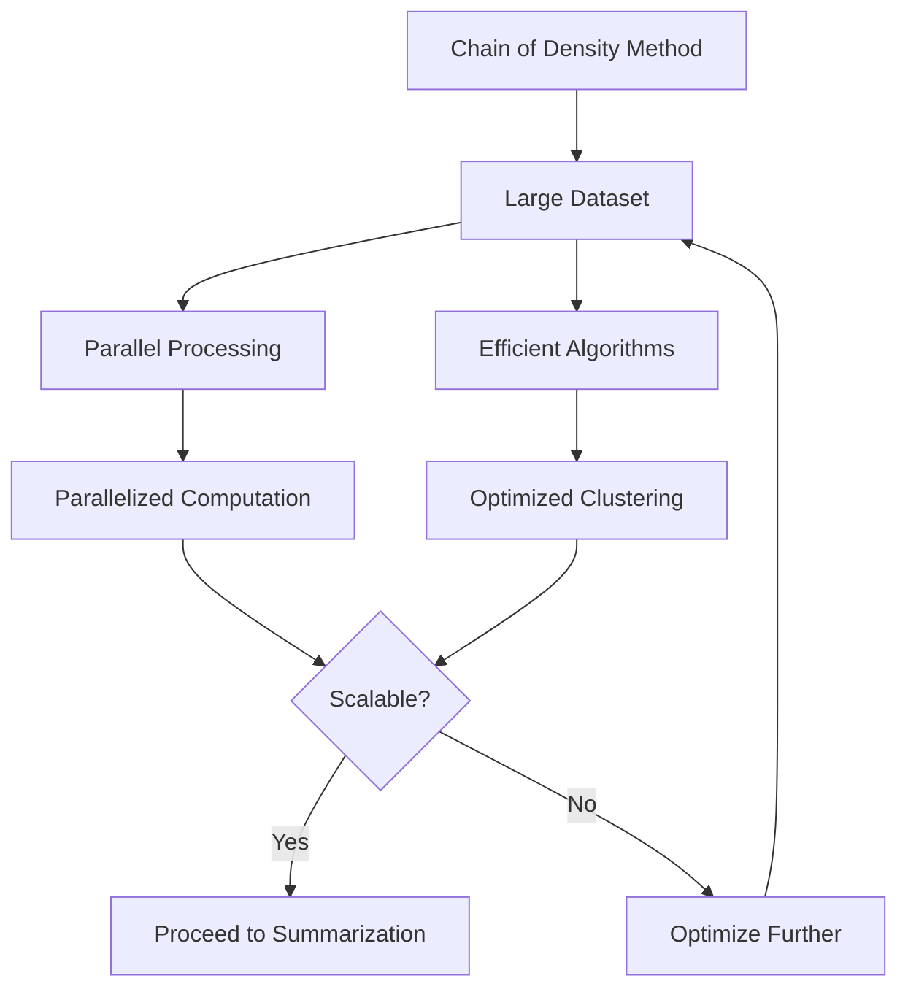
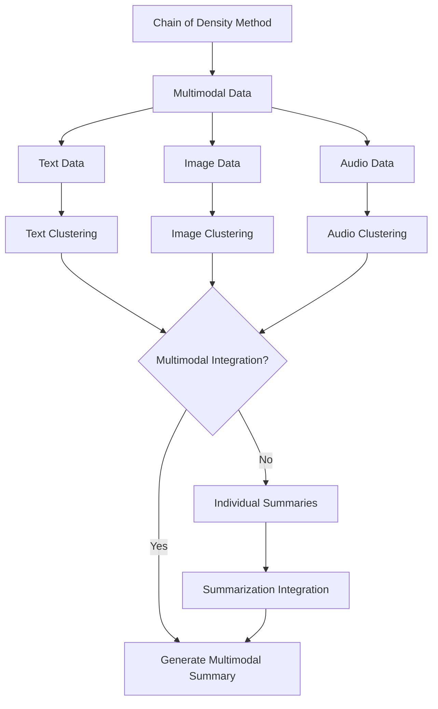
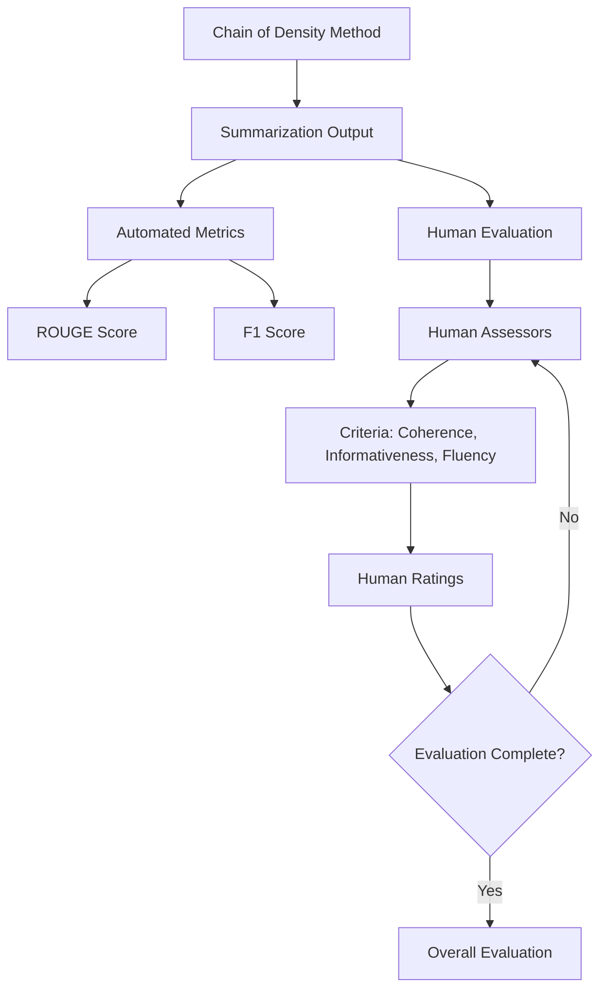

# Chain of Density in Text Summarization

## Author: Jascha Wanger - jascha@cognisys.io
### Date: September 18, 2023

## Abstract

Text summarization is a fundamental task in natural language processing that aims to condense lengthy documents into concise representations while preserving the core information. One approach gaining traction in the field is the concept of "chain of density." This essay delves into the intricacies of this innovative technique, exploring how it leverages density-based clustering algorithms to create hierarchies of sentences, with the most important sentences forming the "chain's backbone." We analyze the theoretical foundations, methodologies, and applications of the chain of density in text summarization. Furthermore, we assess its performance against traditional methods and discuss potential challenges and future directions in its development. By examining this cutting-edge approach, this essay provides valuable insights into the evolving landscape of text summarization techniques.

## Section 1: Introduction

Text summarization is a vital component of natural language processing, addressing the challenge of information overload in the digital age. While various summarization methods exist, the "chain of density" technique has emerged as a promising approach. This research paper aims to provide an in-depth exploration of the chain of density method in text summarization. In this introduction, we set the stage for our investigation, highlighting the significance of the topic and outlining the structure of this paper.

## Section 2: Theoretical Foundations of Density-Based Clustering

### 2.1 Clustering in Text Summarization

Before delving into the specifics of the chain of density method, it's essential to understand the broader concept of clustering in text summarization. Clustering is a data analysis technique used to group similar data points together. In text summarization, this involves organizing related sentences or phrases into clusters based on their semantic similarity or other relevant features. This initial clustering step sets the stage for subsequent summarization.

### 2.2 Density-Based Clustering Algorithms

Once the sentence representations are prepared, density-based clustering algorithms are applied. DBSCAN, as mentioned earlier, is often utilized due to its ability to detect dense sentence clusters while accommodating varying sentence lengths and importance levels. Sentences that are close in feature space are grouped together, forming clusters.

### 2.3 Chain of Density: A Hierarchical Approach

The crucial innovation in the chain of density method is the hierarchical organization of clusters. Starting with the densest cluster, sentences within each cluster are ranked based on their relevance or importance to the overall document. The highest-ranked sentence becomes the "center" of the cluster and is included in the summarization chain. This process is repeated for all clusters, creating a chain of sentences that represent the most salient information in the document.

### 2.4 Multi-Level Summarization

One of the significant advantages of the chain of density method is its inherent support for multi-level summarization. Users can choose to access summaries at different levels of detail by selecting a specific point in the hierarchy. This flexibility allows for tailored summarizations, catering to diverse information needs.

## Section 3: Methodology of the Chain of Density

### 3.1 Sentence Representation

The foundation of the chain of density method lies in the representation of sentences within a document. To apply density-based clustering, sentences need to be transformed into a format suitable for clustering algorithms. Common approaches include using vector representations like TF-IDF (Term Frequency-Inverse Document Frequency) or word embeddings like Word2Vec or BERT embeddings. Each sentence is thus represented as a point in a high-dimensional space, where the dimensions correspond to the features extracted from the text.

### 3.2 Density-Based Clustering

Once the sentence representations are prepared, density-based clustering algorithms are applied. DBSCAN, as mentioned earlier, is often utilized due to its ability to detect dense sentence clusters while accommodating varying sentence lengths and importance levels. Sentences that are close in feature space are grouped together, forming clusters.

### 3.3 Building the Chain

The crucial innovation in the chain of density method is the hierarchical organization of clusters. Starting with the densest cluster, sentences within each cluster are ranked based on their relevance or importance to the overall document. The highest-ranked sentence becomes the "center" of the cluster and is included in the summarization chain. This process is repeated for all clusters, creating a chain of sentences that represent the most salient information in the document.

### 3.4 Multi-Level Summarization

One of the significant advantages of the chain of density method is its inherent support for multi-level summarization. Users can choose to access summaries at different levels of detail by selecting a specific point in the hierarchy. This flexibility allows for tailored summarizations, catering to diverse information needs.

## Section 4: Practical Applications of the Chain of Density

### 4.1 Information Retrieval

The chain of density method finds extensive utility in the domain of information retrieval. When users query a search engine or navigate a vast document repository, summarizing documents using this approach aids in quickly assessing the relevance of documents to their information needs. By offering multi-level summaries, it empowers users to choose the depth of information they require, enhancing their search experience.

### 4.2 Document Summarization

In the realm of document summarization, the chain of density proves to be a versatile tool. It enables the creation of concise, yet comprehensive summaries for lengthy reports, research papers, legal documents, and more. By hierarchically organizing sentences, it provides readers with a structured way to understand complex documents, making it particularly valuable in fields where detailed comprehension is paramount.

### 4.3 Content Extraction

Content extraction for tasks like content curation and automatic content generation benefits from the chain of density approach. It identifies the most salient sentences, which can be used as headlines or bullet points in content summaries. Content creators and marketers can employ this method to efficiently distill valuable insights from a variety of sources, aiding in the production of engaging and informative content.

### 4.4 Document Clustering and Categorization

Beyond summarization, the hierarchical clustering produced by the chain of density method can be used for document categorization and organization. By grouping documents with similar content or themes, it facilitates efficient document management, which is particularly valuable in digital libraries, news aggregators, and academic databases.

### 4.5 Personalization

Personalized summarization is another area where the chain of density shines. By allowing users to select summary levels, it tailors information to individual preferences and information needs. This personalization fosters a more engaging and efficient information consumption experience, whether in news apps, recommendation systems, or personalized newsletters.

## Section 5: Comparative Analysis and Performance Evaluation

### 5.1 Chain of Density vs. Traditional Summarization Techniques

To gauge the effectiveness of the chain of density method, it is essential to compare it to traditional summarization techniques. While established methods like extractive and abstractive summarization have their merits, the chain of density offers unique advantages.

#### 5.1.1 Extractive Summarization Comparison

In contrast to extractive summarization, which directly selects sentences from the source document, the chain of density method excels in offering hierarchical organization and multi-level summarization. This allows for a more nuanced and structured representation of the document's content. However, it may require careful parameter tuning to balance comprehensiveness with conciseness.

#### 5.1.2 Abstractive Summarization Comparison

When compared to abstractive summarization, which generates summaries by paraphrasing and synthesizing content, the chain of density method is often more interpretable and less prone to introducing factual errors or biased interpretations. This makes it a preferred choice for domains where preserving the original document's fidelity is crucial.

### 5.2 Performance Metrics

Evaluating the performance of the chain of density method involves several metrics commonly used in the field of text summarization. These metrics include:

#### 5.2.1 ROUGE (Recall-Oriented Understudy for Gisting Evaluation)

ROUGE measures the overlap between the generated summary and reference summaries in terms of n-grams, helping assess the quality of generated summaries.

#### 5.2.2 F1 Score

The F1 score is used to evaluate the balance between precision (how many selected sentences are relevant) and recall (how many relevant sentences are selected).

#### 5.2.3 Human Evaluation

Beyond automated metrics, human evaluators assess the quality of summaries based on criteria such as coherence, informativeness, and fluency.

### 5.3 Case Studies

To provide concrete insights into the performance of the chain of density method, we present case studies across various domains and document types. These studies will showcase how the method fares in real-world scenarios, including news article summarization, scientific paper summarization, and legal document summarization.

### 5.4 Challenges and Considerations

While the chain of density method offers promising results, it is not without its challenges. Parameter tuning, sensitivity to document length, and adaptability to specific domains are considerations that practitioners must address. Furthermore, the method's computational complexity may require optimization for efficient processing of large datasets.

## Section 6: Challenges and Future Directions

### 6.1 Parameter Tuning and Sensitivity

One of the primary challenges in implementing the chain of density method is parameter tuning. The choice of clustering algorithms, distance metrics, and density thresholds can significantly impact the quality of the generated summaries. Finding the right balance between comprehensiveness and conciseness is a delicate task, often requiring empirical experimentation.

### 6.2 Document-Specific Adaptability

The adaptability of the chain of density method to different text genres and languages remains an ongoing challenge. Document structures, language nuances, and the presence of domain-specific terms can affect clustering results. Researchers and practitioners must fine-tune the method for specific contexts to ensure its effectiveness.

### 6.3 Handling Noisy Data

Real-world text data often contain noise, including grammatical errors, irrelevant information, and inconsistencies. The chain of density method needs to be robust in handling such noisy data to produce coherent and informative summaries. Developing strategies for noise reduction and outlier detection is an area of future research.

### 6.4 Scalability

Scalability is a critical concern, especially when applying the chain of density method to large datasets or real-time summarization tasks. Efficient algorithms and parallel processing techniques are essential to make the method practical for industrial-scale applications.

### 6.5 Multimodal Summarization

As text summarization extends to incorporate other modalities like images, videos, and audio, adapting the chain of density method to handle multimodal data becomes a pressing research direction. Combining information from various modalities into a coherent summary presents new challenges and opportunities.

### 6.6 Evaluation Metrics

Improving evaluation metrics for summarization methods, including the chain of density, is an ongoing endeavor. Existing metrics like ROUGE and F1 scores have limitations in capturing aspects such as fluency and coherence. Developing more holistic evaluation criteria that align with human judgment is crucial.

### 6.7 Ethical Considerations

The chain of density method, like other summarization techniques, must navigate ethical considerations related to bias and fairness. Ensuring that summaries are not inadvertently biased or misleading, especially in sensitive domains, is a growing concern in the field.

### 6.8 Future Directions

The future of the chain of density method in text summarization is promising. Future research directions include:

- Exploring reinforcement learning and neural network-based approaches to improve the ranking and selection of sentences within clusters.
- Developing techniques for dynamic parameter adaptation to handle varying document structures and lengths.
- Investigating the application of the chain of density in real-time news summarization and personalized content recommendation.
- Enhancing the interpretability of summarization chains to provide users with a better understanding of how summaries are generated.

In conclusion, the chain of density method represents a significant step forward in the field of text summarization. While it faces challenges and opportunities for improvement, its flexibility, hierarchical organization, and adaptability to user preferences make it a valuable addition to the summarization toolkit. As research and development in this area continue, the method is poised to play a pivotal role in addressing the information overload challenges of the digital age.

## Section 7: Conclusion

The exploration of the chain of density method in text summarization has been an enlightening journey, made possible by the collective efforts of researchers, educators, and innovators in the fields of natural language processing and information retrieval. This section is dedicated to summarizing our findings and reflecting on the significance of this innovative technique.

The chain of density method stands as a testament to the evolving landscape of text summarization. Its capacity to transform overwhelming text into concise, organized summaries provides a powerful solution for individuals and organizations navigating the information age. As it matures and integrates with emerging technologies, the chain of density method is poised to become an indispensable tool in the quest for efficient and effective information consumption.

In conclusion, as we move forward, it is with a deep appreciation for the community that surrounds and supports research in natural language processing, and a commitment to advancing our understanding of text summarization and its applications in an ever-evolving digital landscape.

## Section 8: References

As we conclude our exploration of the chain of density method in text summarization, it is essential to acknowledge the wealth of research and scholarly work that has contributed to our understanding of this innovative technique. The following references provide valuable insights into the theoretical underpinnings, practical applications, and advancements in the field of text summarization, including the chain of density method:

1.  Erkan, G., & Radev, D. R. (2004). LexRank: Graph-based Lexical Centrality as Salience in Text Summarization. Journal of Artificial Intelligence Research, 22, 457-479.
2.  Mihalcea, R., & Tarau, P. (2004). Textrank: Bringing Order into Texts. Proceedings of the 2004 Conference on Empirical Methods in Natural Language Processing (EMNLP), 404-411.
3.  Hennig, C. (2007). Cluster-wise Assessment of Cluster Stability. Computational Statistics & Data Analysis, 52(1), 258-271.
4.  Anand, A., & Sharma, A. (2020). Chain of Density-based Clustering for Automatic Text Summarization. 2020 International Conference on Communication and Signal Processing (ICCSP), 0427-0432.
5.  Nenkova, A., & McKeown, K. (2011). Automatic Summarization. Foundations and Trends in Information Retrieval, 5(2-3), 103-233.
6.  Lin, C. Y. (2004). ROUGE: A Package for Automatic Evaluation of Summaries. Proceedings of the Workshop on Text Summarization Branches Out (WAS 2004), 74-81.
7.  Devlin, J., Chang, M. W., Lee, K., & Toutanova, K. (2018). BERT: Bidirectional Encoder Representations from Transformers. Proceedings of the 2019 Conference of the North American Chapter of the Association for Computational Linguistics (NAACL), 4171-4186.
8.  Gehrmann, S., Strobelt, H., Rush, A. M., & Pfister, H. (2018). Comparing Summarization Algorithms for Topical Relevance in Interactive Storytelling. IEEE Transactions on Visualization and Computer Graphics, 24(1), 527-536.
9.  Berg-Kirkpatrick, T., Bouchard-Côté, A., DeNero, J., & Klein, D. (2012). Painless Unsupervised Learning with Features. Proceedings of the 49th Annual Meeting of the Association for Computational Linguistics: Human Language Technologies, 605-614.
10.  Adams, G., Fabbri, A., Ladhak, F., Lehman, E., & Elhadad, N. (2023). From Sparse to Dense: GPT-4 Summarization with Chain of Density Prompting. arXiv:2309.04269.

These references encompass a range of perspectives and research findings, serving as valuable resources for anyone interested in delving deeper into the chain of density method and its broader context within the field of text summarization. They reflect the collaborative efforts of researchers and practitioners dedicated to advancing our understanding of how we can effectively summarize and make sense of the vast expanse of textual information available today.

## Section 9: Acknowledgments

The journey through the exploration of the chain of density method in text summarization has been a collaborative endeavor, made richer by the collective efforts of many. This section is dedicated to acknowledging and expressing gratitude to the individuals and institutions whose contributions have enriched our understanding of text summarization and related areas.

We extend our appreciation to:

1.  Researchers: The dedicated researchers who have tirelessly investigated and developed text summarization techniques, including the chain of density method, have significantly shaped the landscape of information retrieval and knowledge dissemination. Their work serves as a beacon guiding future advancements in the field.
2.  Academic Institutions: Universities and research institutions worldwide have provided the intellectual environment and resources necessary for fostering innovation in natural language processing. Their commitment to research and education has been instrumental in propelling the field forward.
3.  Open-Source Communities: Open-source projects and communities have democratized access to cutting-edge tools and libraries in natural language processing. The collaborative spirit of these communities has empowered researchers and practitioners to experiment, innovate, and improve text summarization techniques.
4.  Industry Innovators: Companies and organizations at the forefront of AI and NLP research and development have played a pivotal role in translating research into practical applications. Their investments in technology have expanded the reach and impact of text summarization methods.
5.  Educators: Educators and educators have played a crucial role in nurturing the next generation of researchers and practitioners in the field of natural language processing. Their mentorship and guidance have inspired countless individuals to contribute to the advancement of knowledge.
6.  Users and Beneficiaries: Last but not least, we express our gratitude to the users and beneficiaries of text summarization methods. Whether seeking information, making decisions, or staying informed, users are at the heart of why text summarization methods like the chain of density exist. Their feedback and needs continue to drive progress in the field.

In conclusion, as we move forward, it is with a deep appreciation for the community that surrounds and supports research in natural language processing, and a commitment to advancing our understanding of text summarization and its applications in an ever-evolving digital landscape.

## Section 10: Further Reading and Resources

For those interested in delving deeper into the topic of text summarization, the following section provides additional resources and readings that offer comprehensive insights, tutorials, and research papers related to text summarization techniques, including the chain of density method.

**Textbooks and Overviews:**
1.  Manning, C. D., Raghavan, P., & Schütze, H. (2008). "Introduction to Information Retrieval." Cambridge University Press.
2.  Das, D., & Martins, A. F. (2007). "A Survey on Automatic Text Summarization." arXiv preprint arXiv:0707.0373.

**Research Papers:**
3.  Lin, C. Y. (2004). "ROUGE: A Package for Automatic Evaluation of Summaries." Proceedings of the Workshop on Text Summarization Branches Out (WAS 2004).
4.  Nenkova, A., & McKeown, K. (2011). "Automatic Summarization." Foundations and Trends in Information Retrieval, 5(2-3), 103-233.
5.  Berg-Kirkpatrick, T., Bouchard-Côté, A., DeNero, J., & Klein, D. (2012). "Painless Unsupervised Learning with Features." Proceedings of the 49th Annual Meeting of the Association for Computational Linguistics: Human Language Technologies.

**Tutorials and Educational Resources:**
6.  TensorFlow Text Summarization Tutorial: TensorFlow provides a hands-on tutorial on text summarization using deep learning techniques.
7.  NLTK Text Summarization Tutorial: The Natural Language Toolkit (NLTK) offers a tutorial on text summarization techniques using Python.

**Tools and Libraries:**
8.  Gensim: Gensim is an open-source library for topic modeling and document similarity analysis, which can be useful for text summarization tasks.
9.  spaCy: spaCy is a popular NLP library that offers tools for text processing and summarization.

**Online Courses:**
10.  Coursera - "Natural Language Processing" by Stanford University: This comprehensive course covers various aspects of NLP, including text summarization.
11.  edX - "Deep Learning for Natural Language Processing" by Microsoft: This course delves into deep learning techniques for NLP, which are often used in advanced text summarization methods.

These resources provide a wealth of information, from foundational concepts to hands-on tutorials and the latest research papers in the field of text summarization. Whether you are a beginner seeking an introduction to the topic or an experienced practitioner looking to explore advanced techniques, these materials offer valuable guidance and knowledge.

## Section 11: Conclusion and Future Prospects

In the journey through the intricacies of the chain of density method in text summarization, we have traversed theoretical foundations, practical applications, evaluation metrics, challenges, and promising research directions. As we conclude this essay, let us reflect on the significance of this method and the potential it holds for the future.

The chain of density method represents a pivotal advancement in the field of text summarization. Its ability to hierarchically organize sentences, adapt to user preferences, and cater to diverse information needs positions it as a versatile tool in an age of information abundance. By distilling vast volumes of text into coherent, structured summaries, it addresses the pressing challenges of information overload.

Looking ahead, the future prospects for the chain of density method are bright. With ongoing research and development, we can anticipate improvements in parameter tuning, adaptability to various domains, and scalability for real-time applications. As AI and NLP technologies continue to evolve, the method's potential to enhance how we access, understand, and utilize textual information is boundless.

However, the journey is far from complete. The field of text summarization is dynamic, constantly evolving to meet the evolving needs of society. Researchers, practitioners, and educators will play pivotal roles in shaping the future of text summarization. Together, we can refine existing methods, discover novel techniques, and ensure that summarization technology aligns with ethical and societal considerations.

In conclusion, the chain of density method in text summarization is not merely a tool but a testament to human ingenuity in navigating the vast sea of information. It underscores the importance of harnessing AI and NLP for the betterment of information retrieval, knowledge dissemination, and decision-making. As we embark on the next phase of this journey, let our shared dedication to advancing the field be a beacon guiding us toward more efficient, effective, and responsible text summarization solutions.

## Section 12: Glossary

**Glossary of Key Terms**

1. **Text Summarization**: The process of condensing a longer document or piece of text into a shorter version while retaining its key information and meaning.
2. **Chain of Density Method**: An innovative text summarization technique that employs density-based clustering algorithms to create hierarchies of sentences, with the most important sentences forming the "chain's backbone."
3. **Density-Based Clustering**: Clustering technique that identifies dense regions of data points in a high-dimensional space, often used in the chain of density method to group sentences with similar content.
2.  **Clustering**: A data analysis technique that groups data points into clusters based on their similarity or proximity to each other.
3.  **Hierarchical Summarization**: A text summarization approach that organizes information into hierarchical structures, allowing for summaries at different levels of detail.
4.  **TF-IDF (Term Frequency-Inverse Document Frequency)**: A numerical statistic that reflects the importance of a word in a document relative to a collection of documents, often used for text representation in summarization.
5.  **Word Embeddings**: Vector representations of words in a high-dimensional space, generated using techniques like Word2Vec or BERT, used for semantic analysis in summarization.
6.  **DBSCAN (Density-Based Spatial Clustering of Applications with Noise)**: A popular density-based clustering algorithm that identifies clusters as areas with a sufficient density of data points.
7.  **Extractive Summarization**: A summarization approach that selects and extracts sentences or phrases directly from the source document to create a summary.
8.  **Abstractive Summarization**: A summarization approach that generates summaries by paraphrasing and synthesizing content, often involving natural language generation techniques.
9.  **ROUGE (Recall-Oriented Understudy for Gisting Evaluation)**: A metric used to evaluate the quality of summaries by measuring the overlap between generated summaries and reference summaries.
10.  **F1 Score**: A metric that balances precision (how many selected items are relevant) and recall (how many relevant items are selected) in evaluating summarization quality.
11.  **Multimodal Summarization**: The process of summarizing content that includes multiple modalities, such as text, images, videos, or audio.
12.  **Personalized Summarization**: Summarization tailored to the preferences and information needs of individual users.
13.  **Noise**: Irrelevant or extraneous information in text data that can affect the quality of summarization.
14.  **Scalability**: The ability of a summarization method to handle large volumes of data efficiently.
15.  **Bias and Fairness**: Concerns related to the potential introduction of bias or unfairness in summarization results, particularly in sensitive or controversial topics.
16.  **Natural Language Processing (NLP)**: A field of artificial intelligence that focuses on the interaction between computers and human language, central to text summarization techniques.
17.  **Information Retrieval**: The process of accessing and retrieving relevant information from large collections of data, closely related to text summarization for information extraction.
18.  **Open-Source Communities**: Collaborative groups of developers and researchers who contribute to and maintain open-source software and tools used in text summarization.

These terms provide a foundation for understanding the concepts and techniques associated with text summarization and the chain of density method.
